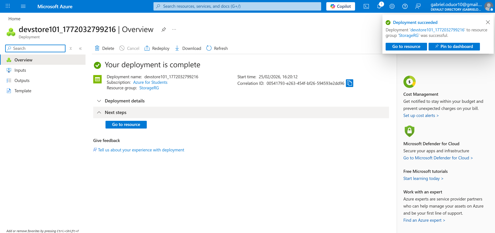
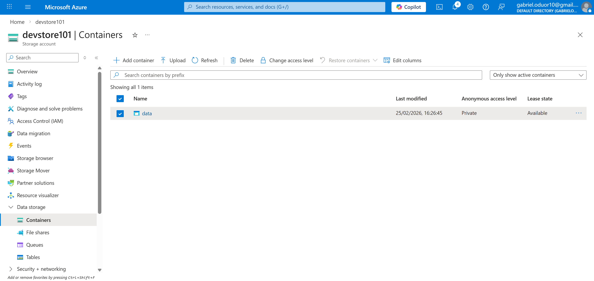
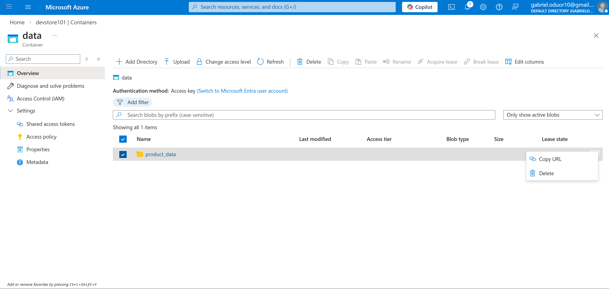
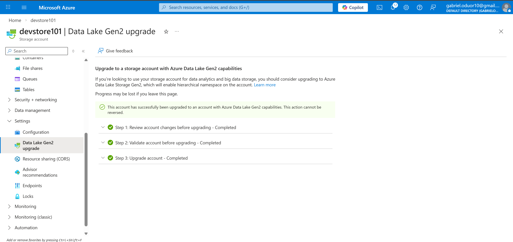
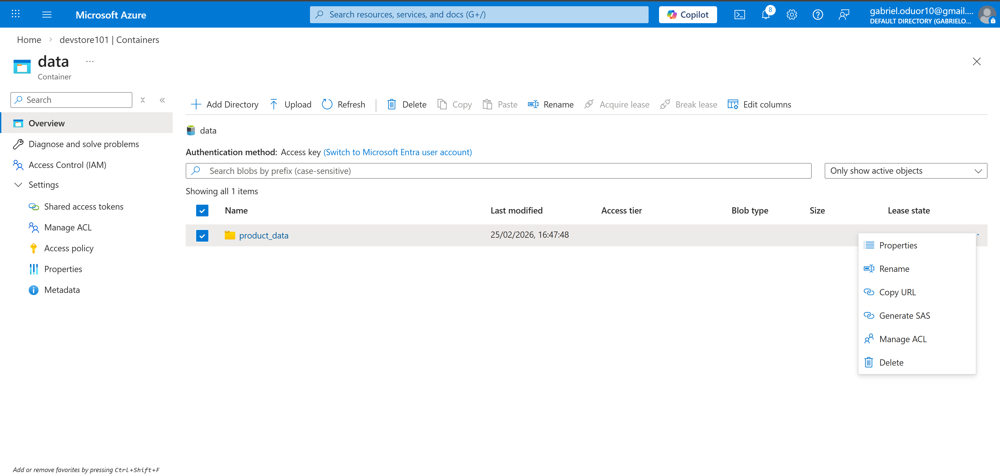
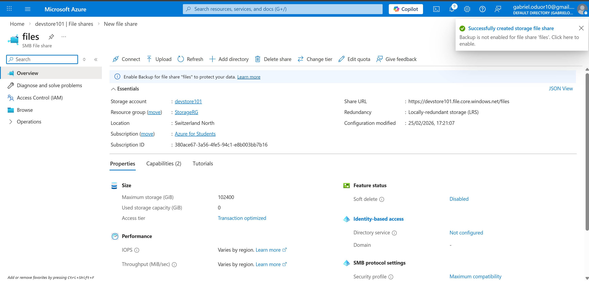
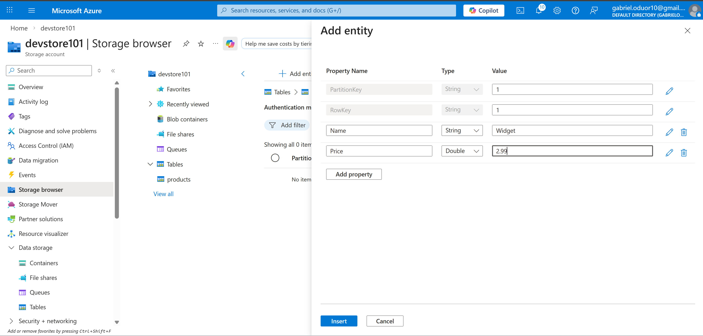
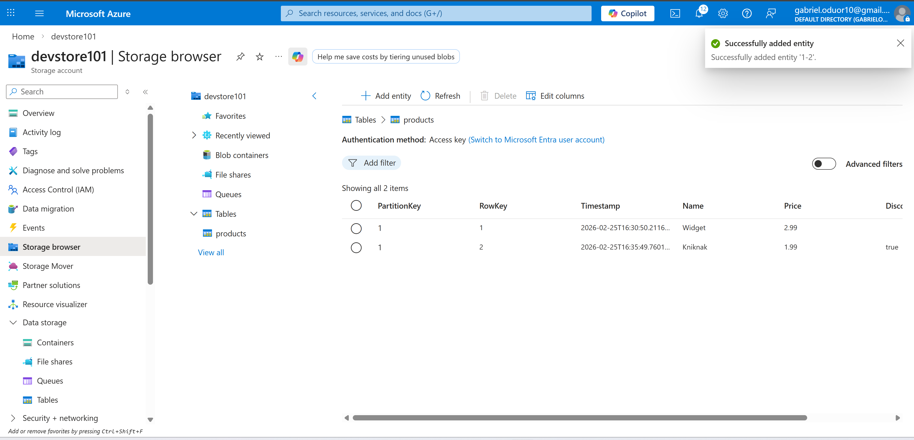

# Azure Storage Core Services

## Step 1 – Provision Storage Account

1. Create new Resource Group
2. Create Storage Account
   - Performance: Standard
   - Redundancy: LRS
   - Soft delete: Disabled
3. Deploy and verify

Key Decision:
- LRS chosen for cost-effective lab setup
- Separate resource group simplifies cleanup

---

## Step 2 – Blob Storage (Flat Namespace)

1. Create container: data
2. Access level: Private
3. Upload product1.json
4. Create virtual folder via upload path

Observation:
- Folders do not truly exist in flat namespace
- They are name prefixes only

Engineering Concept:
Flat namespace optimizes scalability via blob indexing.

---

## Step 3 – Upgrade to Data Lake Gen2

1. Navigate to Data Lake Gen2 upgrade
2. Enable hierarchical namespace
3. Wait for upgrade completion

Upload:
- product2.json into existing folder

Observation:
- Folder now supports rename and permission management

Engineering Concept:
Hierarchical namespace enables:
- Recursive operations
- ACLs
- Big data workload compatibility

---

## Step 4 – Azure Files

1. Create file share: files
2. Tier: Transaction optimized
3. Backup: Disabled
4. Review OS mount scripts

Engineering Concept:
Azure Files supports lift-and-shift workloads using SMB/NFS protocols.

---

## Step 5 – Azure Tables

1. Create table: products
2. Add Entity:
   - PartitionKey: 1
   - RowKey: 1
   - Name: Widget
   - Price: 2.99

3. Add second entity:
   - PartitionKey: 1
   - RowKey: 2
   - Name: Kniknak
   - Price: 1.99
   - Discontinued: true

Engineering Concepts:
- PartitionKey distributes load
- RowKey ensures uniqueness
- Schema flexibility allows new properties without migration
- Automatic Timestamp column tracks modifications

---

## Cleanup

Delete the resource group to prevent ongoing charges.
