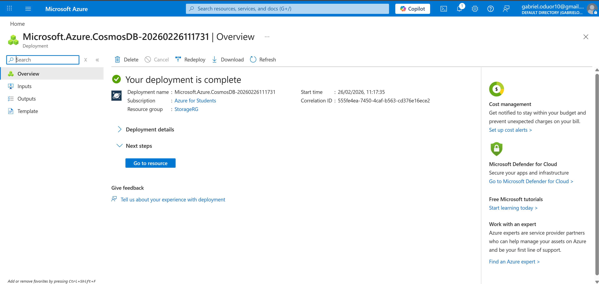
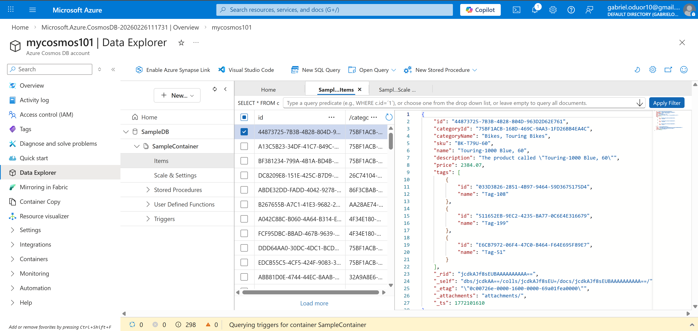
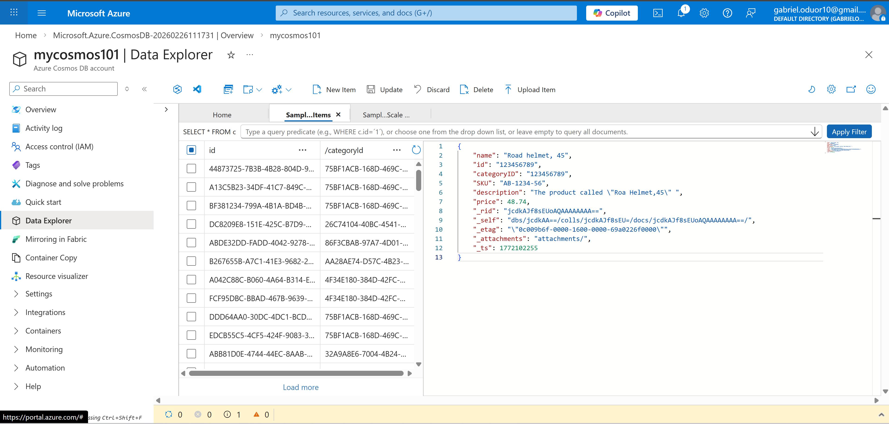
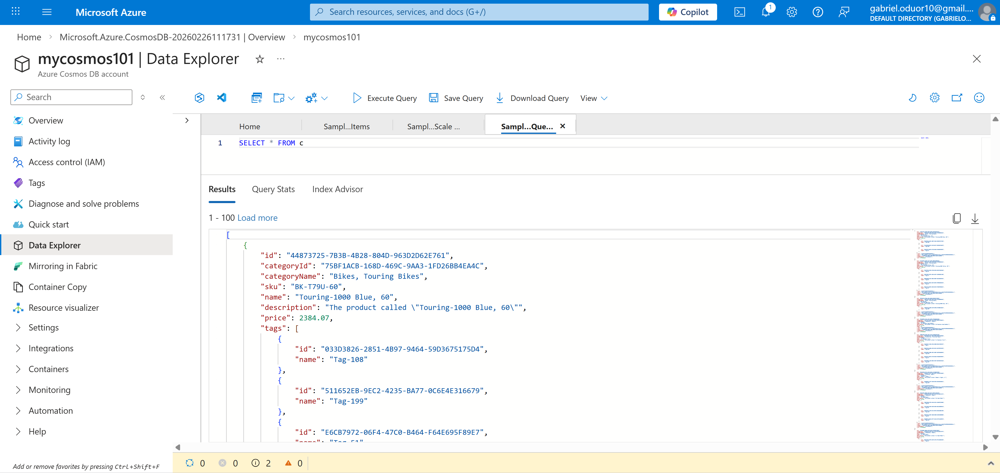
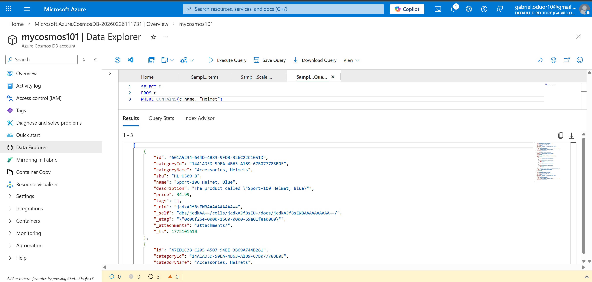

# Technical Breakdown

## Step 1 – Provision Azure Cosmos DB Account

- Selected Azure Cosmos DB (NoSQL API)
- Workload type: Learning
- Capacity mode: Provisioned throughput
- Free tier disabled (not available)
- Availability zones: Disabled

Purpose:
The Cosmos DB account acts as the global distribution and management boundary for databases and containers.

Engineering Insight:
Provisioned throughput ensures predictable performance by allocating Request Units (RUs).



---

## Step 2 – Create Sample Database and Container

- Opened Data Explorer
- Used Launch Quick Start
- Created:
  - SampleDB
  - SampleContainer

Purpose:
Quick Start provisions a working database and container with sample data for testing.

Engineering Insight:
Containers are the scalability unit in Cosmos DB and define partitioning strategy.



---

## Step 3 – View and Create JSON Items

- Viewed existing JSON documents
- Created new item with custom JSON structure
- Saved item to container

Example item:
```
 {
    "name": "Road Helmet,45",
    "id": "123456789",
    "categoryID": "123456789",
    "SKU": "AB-1234-56",
    "description": "The product called \"Road Helmet,45\" ",
    "price": 48.74
}
```

Observations:
- id must be unique within the container
- Cosmos DB automatically adds:
  - _rid
  - _self
  - _etag
  - _ts
  - _attachments

Engineering Insight:
Cosmos DB supports schema flexibility - new fields can be added without migration.



---

## Step 4 – Query JSON Data

Executed default query:

SELECT * FROM c



Executed filtered query:

SELECT *
FROM c
WHERE CONTAINS(c.name,"Helmet")



Purpose:
Demonstrated SQL-like querying of JSON documents using the NoSQL API.

Engineering Insight:
Cosmos DB enables structured querying without requiring rigid relational schemas.
