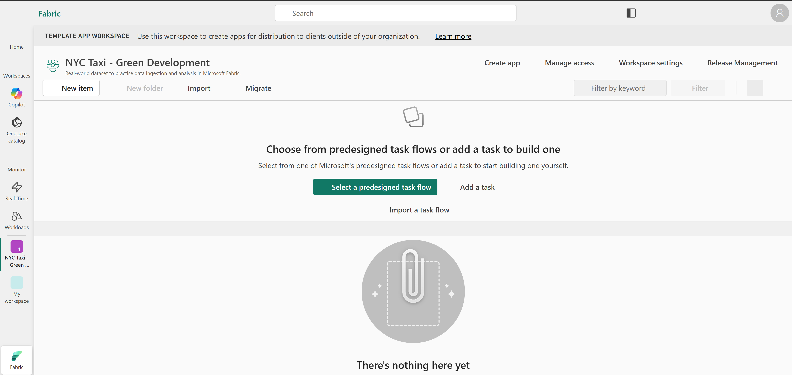
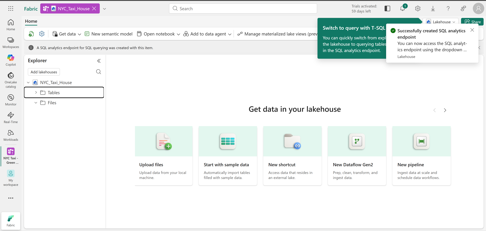
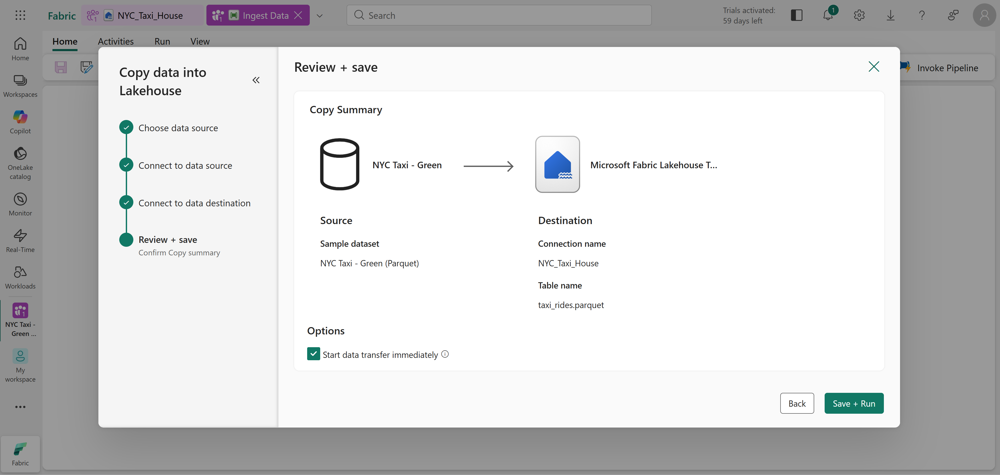
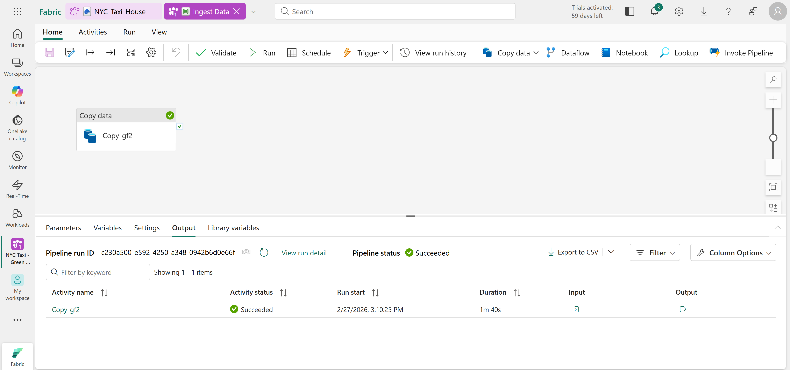
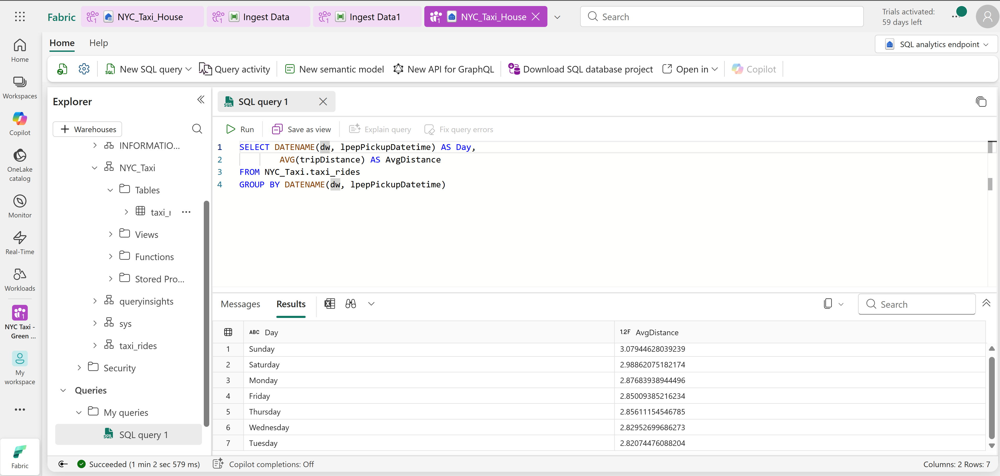

# Technical Breakdown

## Step 1 – Create Fabric Workspace

- Created new workspace
- Enabled Fabric capacity (Trial)
- Dedicated workspace for lab isolation

Purpose:
Workspace acts as the governance boundary for lakehouses, pipelines, notebooks, and reports.



---

## Step 2 – Create Lakehouse

- Created new Lakehouse inside workspace
- Reviewed:
  - Tables (managed Delta tables)
  - Files (raw/staged files in OneLake)

Engineering Insight:
Lakehouse unifies data lake storage with structured table semantics using Delta Lake.



---

## Step 3 – Ingest Data via Pipeline

- Created new Data Pipeline: "Ingest Data"
- Source: NYC Taxi – Green (sample dataset)
- Destination:
  - Root folder: Tables
  - Load to new table
  - Table name: taxi_rides
  - Partitioning: Disabled

Pipeline executed successfully (~75M+ rows).

Engineering Insight:
Pipelines enable scalable ingestion without manual coding and support scheduling in production scenarios.





---

## Step 4 – Verify Managed Delta Table

- Refreshed Lakehouse explorer
- Confirmed creation of taxi_rides table
- Verified data preview

Engineering Insight:
Loading directly into Tables creates managed Delta Lake tables that optimized queries.


---

## Step 5 – Query Using SQL Analytics Endpoint

Switched to SQL Analytics Endpoint.

Executed query:

```
SELECT  
    DATENAME(dw,lpepPickupDatetime) AS Day,
    AVG(tripDistance) AS AvgDistance
FROM taxi_rides
GROUP BY DATENAME(dw,lpepPickupDatetime)
```

Result:
Average trip distance grouped by day of week.

Engineering Insight:
Lakehouse enables immediate SQL-based analytics without moving data to a separate warehouse.



---
