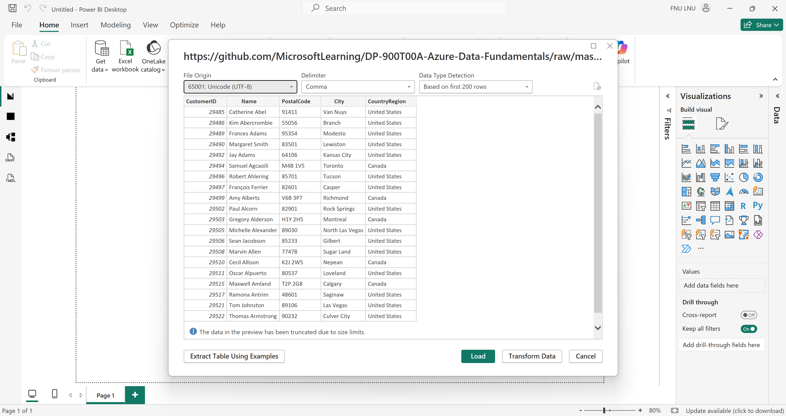
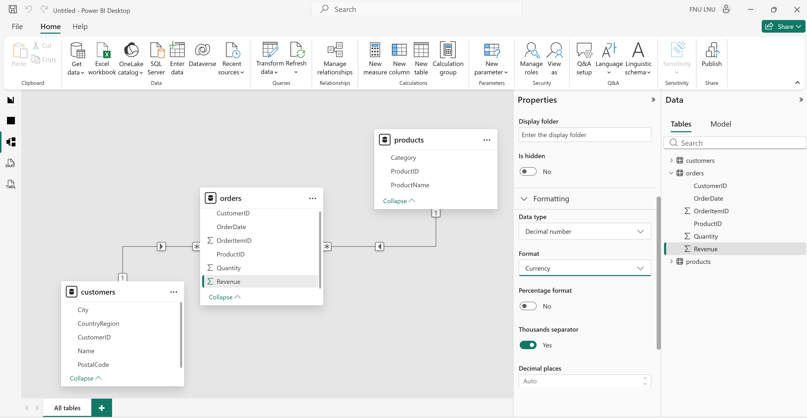
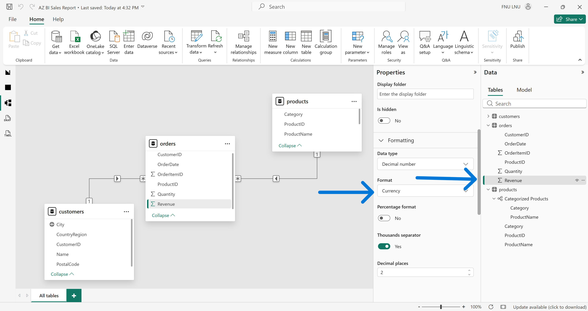
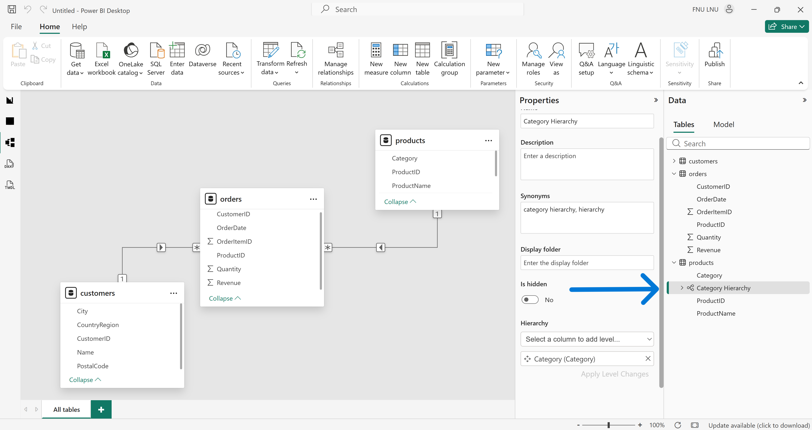
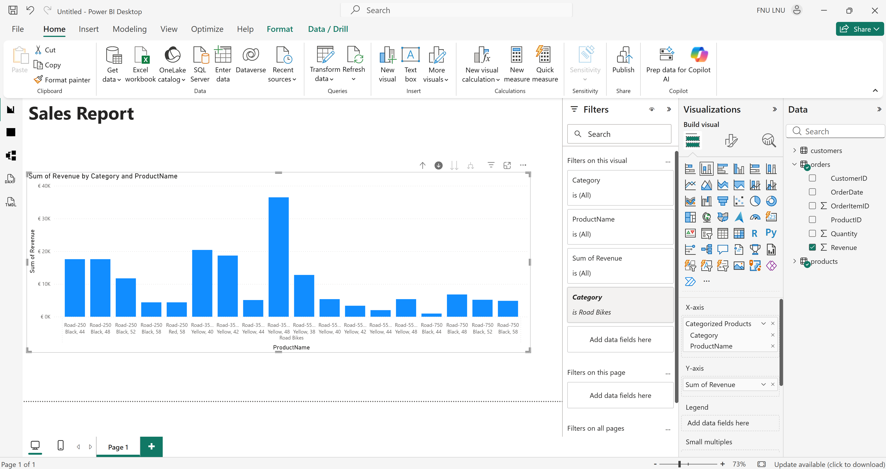
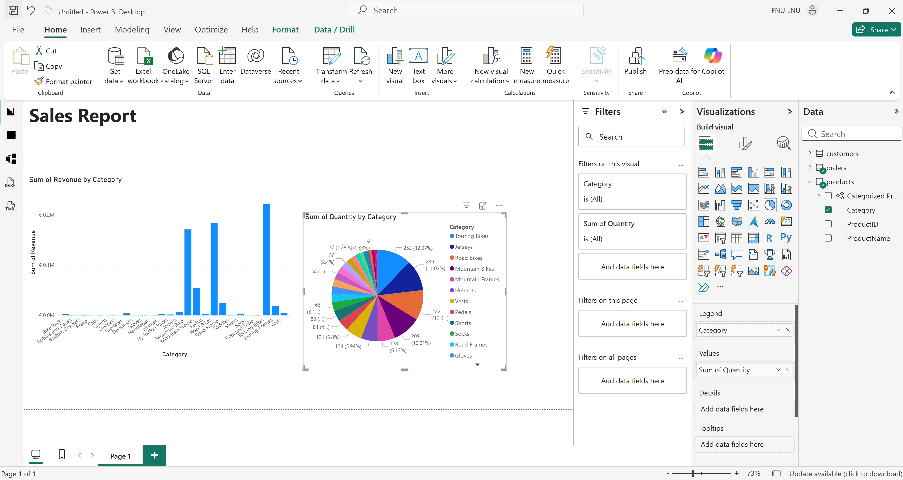
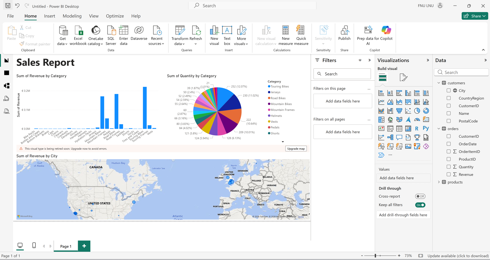
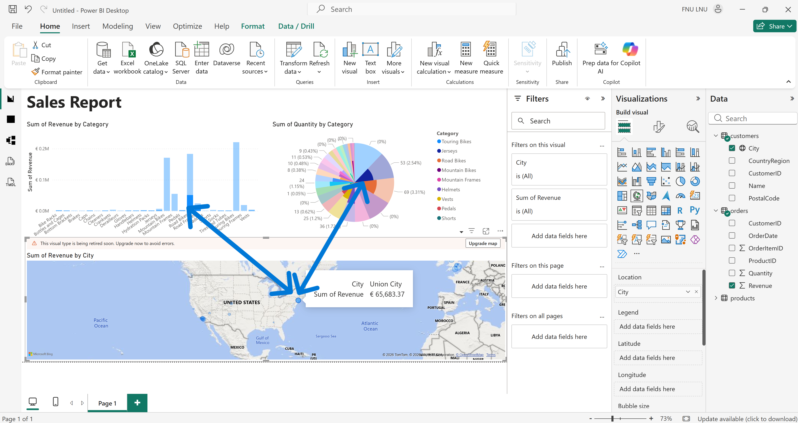
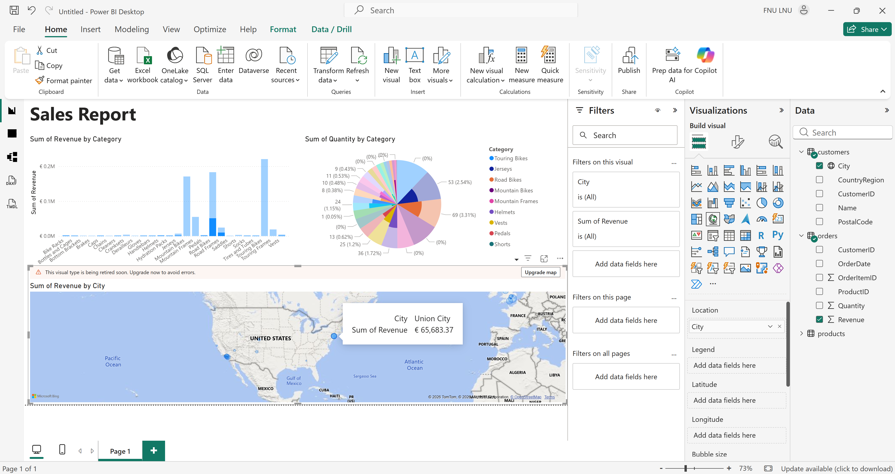

# Technical Breakdown

## Step 1 – Install Power BI Desktop

- Downloaded Power BI Desktop installer
- Installed locally
- Launched application

Purpose:
Power BI Desktop is the report authoring tool used to build data models and interactive reports.

---

## Step 2 – Import Data (Web Sources)

Imported three datasets using the Web connector:

Customers:
```
https://github.com/MicrosoftLearning/DP-900T00A-Azure-Data-Fundamentals/raw/master/power-bi/customers.csv
```

Products:
```
https://github.com/MicrosoftLearning/DP-900T00A-Azure-Data-Fundamentals/raw/master/power-bi/products.csv

```
Orders:
```
https://github.com/MicrosoftLearning/DP-900T00A-Azure-Data-Fundamentals/raw/master/power-bi/orders.csv
```


All datasets loaded directly into the data model.

Engineering Insight:
Using multiple related tables enables relational modeling and cross-entity analysis.



---

## Step 3 – Explore and Refine Data Model

### Revenue Formatting

- Selected Revenue field in Orders table
- Set Format to Currency

Purpose:
Ensure consistent monetary display in report visuals.



---

### Create Product Hierarchy

- Created hierarchy from Category field
- Added ProductName to hierarchy
- Renamed hierarchy to "Categorized Product"

Engineering Insight:
Hierarchies enable drill-down functionality in visualizations.



---

### Configure Geographic Data

- Selected City field in Customers table
- Set Data Category to City

Purpose:
Enable accurate map visualization and geocoding.

---

## Step 4 – Enable Map Visuals

- Opened File - Options - Security
- Enabled "Use Map and Filled Map visuals"

Purpose:
Allow geographic visualizations within reports.

---

## Step 5 – Create Report Visualizations

### Add Report Title

- Inserted text box: "Sales Report"
- Formatted text (Bold, size 32)

---

### Revenue by Category (Column Chart)

- Added Categorized Product hierarchy
- Added Revenue field
- Converted table to Stacked Column Chart
- Enabled drill-down

Observed:
Drill-down from Category to Product level.



---

### Quantity by Category (Pie Chart)

- Added Quantity and Category fields
- Converted visualization to Pie Chart

Purpose:
Display proportional contribution by category.



---

### Revenue by City (Map)

- Added City and Revenue fields
- Generated map visualization
- Interacted with map to observe cross-highlighting



Engineering Insight:
Cross-highlighting enables interactive filtering across visuals.



---

## Step 6 – Save Report

- Saved report as .pbix file
- Confirmed model, queries, and visuals persisted



Optional:
Publish to Power BI Service for sharing and collaboration.
